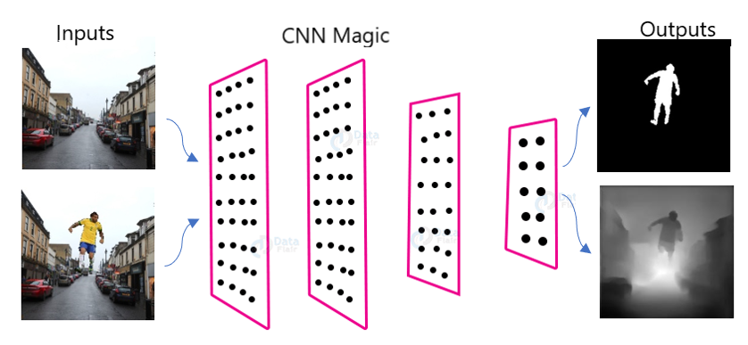

# Mask-and-Depth-Prediction
The problem comes under the domain of single class semantic segmentation (mask) and supervised depth estimation (depth). Here, I present my entire journey of how I approached the problem, starting from the data creation. 

I will explain every thing in detail but let's look at the results first:

## Dataset
The one used in the project is a custom dataset. Please refer <a href = 'https://github.com/akshatjaipuria/Mask-and-Depth-Prediction/tree/master/data#about-the-data'>`this`</a> for details regarding the data creation.
Some of the samples from the dataset:
> bg

> fg

> fg_mask

> fg_bg

> fg_bg_mask

> fg_bg_depth


## What am I supposed to end up with?
My model is supposed to take two images, backgroung(bg) and fg_bg, as inputs at once. The output should be the mask, which is the segmented footballer in the fg_bg and the depth map of the fg_bg. The images are of dimension 224x224, both for imputs and outputs.



## Data Loader
The very first step is how we load data to train the model. Since it's a custom dataset, the dataloder had to be written according to my folder structure. The images that are to be loaded include bg, fg_bg, mask and depths. This <a href="https://github.com/akshatjaipuria/Mask-and-Depth-Prediction/blob/master/model/data_loader.py" target="_blank">`File`</a> can be referred for the code.

On a brief note, I use the PIL library to load the images. We have 100 bg, 400k fg_bg, 400k masks and 400k depth. Onle one bg images corresponds to 4000 images from each of the other categories. Instead of making copies of bg, I decided to play with the index to make that work with 100 images only 😆. The images are in such order that fg_bg, mask and depth from index 0-3999, 4000-7999, 8000-11999 ... correspond to bg at index 0, 1, 2, ... The simple solution is to chnage the bg index as:
```Python
bg_index = int(index / 4000)
```

